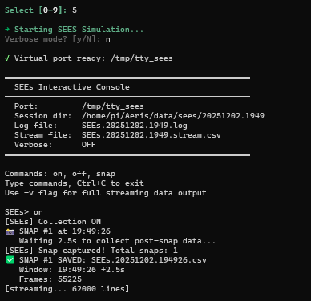
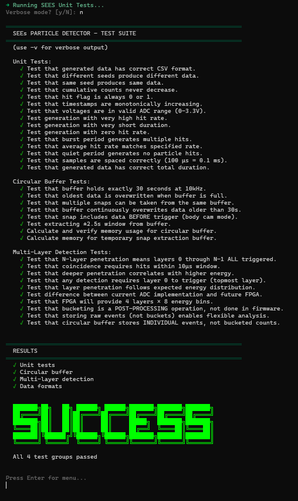
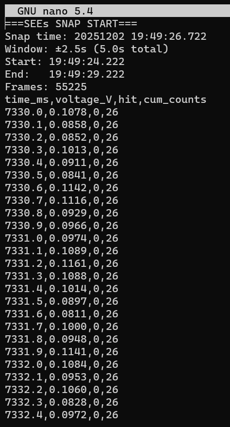

# AERIS / SEEs Software

## Brief Overview

This is the code repository for the SEEs (Solar Energetic Events) Payload firmware for the AERIS mission. SEEs is one of three scientific payloads creating the **first-ever trimodal, temporally-linked dataset** examining upper atmospheric composition (NOx, O3) during solar particle events.

**AERIS Payload Architecture:**
- **VIA** (spectrometer) - Takes snapshots, triggers GPIO to coordinate other payloads
- **SEEs** (particle detector) - Continuous recording, ±2.5s window on VIA trigger
- **AMPPs** (plasma detector) - Continuous recording, ±2.5s window on VIA trigger

**Temporal Linking (The Key):**

VIA controls timing. When VIA captures a spectrum, it pulses GPIO → SEEs and AMPPs capture synchronized ±2.5s windows → All three datasets bundled with VIA's timestamp → OBC packages for downlink.

**Why Body Cam Mode:** SEEs and AMPPs don't track absolute time - they only count "1 second, 1 second, 1 second." The ±2.5s buffer captures what happened BEFORE the VIA trigger (pre-event particle flux) and AFTER (post-event response). This creates temporally-linked trimodal measurements of atmospheric chemistry during solar particle events.

SEEs payload uses a SiPM-based particle detector connected to Teensy 4.1 microcontroller.

The firmware handles:
- ADC-based data acquisition from SiPM detector (10 kHz sampling)
- Windowed particle detection with hysteresis and refractory logic
- 30-second circular buffer (always recording, "body cam" mode)
- Snap capture: ±2.5s window extraction on demand
- Command console interface via USB Serial
- Live CSV streaming to computer

## System Architecture

```
SiPM Detector (Analog)
         ↓
Teensy 4.1 (SEEs Payload)
    ├─ ADC (A0) - 10 kHz sampling
    ├─ SD Card (rolling buffer)
    ├─ USB Serial (command console + data stream)
    └─ Future: UART → Artemis OBC → Radio

Future FPGA version:
    SiPM → FPGA (histograms) → Teensy → OBC
```

**Current Version:** ADC-based prototype with command control

## Key Libraries

| Library | Purpose |
|---------|---------|
| [SdFat](https://github.com/greiman/SdFat) | High-performance SD card library for data logging |
| [pyserial](https://pypi.org/project/pyserial/) | Python serial communication for the interactive console |
| [pty](https://docs.python.org/3/library/pty.html) | Unix pseudo-terminal for virtual serial port simulation |

## Quick Start

**👉 See [QUICKSTART.md](QUICKSTART.md) for complete workflow**

### On the Pi 400

```bash
ssh aeris@192.168.120.22
aeris
```

That's it! The AERIS console handles everything - pick from the menu:

- **4** - SEES Unit Tests
- **5** - SEES Simulation (no hardware needed)
- **6** - SEES HIL Test (real Teensy)

Or use CLI shortcuts:

```bash
aeris sees test      # Run unit tests
aeris sees sim       # Run simulation
aeris sees sim -v    # Simulation with verbose output
```


### Local Development

```bash
# Build and upload firmware
cd SEEsDriver
pio run --target upload

# Run console
./SEEs.sh
```

## Build Instructions
1. Download and install VSCode & GitHub Desktop.
   * VSCode: https://code.visualstudio.com/download
   * GitHub Desktop: https://desktop.github.com/download/
2. Install both the C/C++ and PlatformIO extension in VSCode.
   * PlatformIO: https://platformio.org/install/ide?install=vscode
   * C/C++: https://code.visualstudio.com/docs/languages/cpp
3. Clone the repository from GitHub Desktop by clicking "Add" at the top left, "Clone Repository...", "URL," copying the link below into the prompt, and then clicking Clone.
   * Repository URL: https://github.com/hsfl/aeris-sees-software.git
4. Go to VSCode and initialize the PlatformIO extension.
5. In the "QUICK ACCESS" column, click on "Open" and then "Open Project" in the tab that opens. Locate and choose the "SEEsDriver" folder within the "aeris-sees-software" folder.
   * This should have opened the SEEsDriver folder as a PlatformIO project with all the dependencies and configurations it needs.
6. From the explorer column on the left, navigate the SEEsDriver folder to "src", then to "main.cpp".
7. On the bottom left are multiple buttons; click the checkmark to build the code, confirming a successful build when [SUCCESS] appears on the terminal that pops up.
   * That finishes building the software.

To get relevant data, continue to "Getting Data" section.

## Getting Data with Teensy 4.1

### Hardware Connections
1. **SiPM Detector**: Connect fast-out to Teensy pin A0 (0-3.3V)
2. **SD Card**: Insert into Teensy 4.1 built-in SD card slot
3. **USB Serial**: Connect micro-USB to computer for command console
4. **Power**: Provide 5V power to Teensy 4.1

### Detection Setup
The firmware uses windowed detection on the ADC input:
- **Sampling rate**: 10 kHz (100 µs per sample)
- **Detection window**: 0.30V - 0.80V
- **Hysteresis**: Re-arm below 0.30V
- **Refractory period**: 300 µs (prevents double-counting)

### Data Flow

**Circular Buffer (Body Cam Mode):**
- Buffer starts recording on power-up (always active)
- Stores last 30 seconds of detector data in RAM
- Oldest samples automatically overwritten when full

**Commands:**
- `on` - Enable Serial CSV streaming (debugging)
- `off` - Disable Serial streaming
- `snap` - Save ±2.5s window to SD card (includes pre-event data!)

**Snap Behavior:**
- Captures 2.5s BEFORE trigger + 2.5s after (5 seconds total)
- Saves to: `snaps/snap_NNNNN_<timestamp>.csv`
- Non-blocking: buffer keeps recording during snap

### Data Output Formats

- **Live CSV stream**: `time_ms,voltage_V,hit,cum_counts`
- **Snap files**: `snaps/snap_NNNNN_<timestamp>.csv` (±2.5s windows)
- **Format**: `time_ms,voltage_V,hit,layers,cum_counts,timestamp_us`

### Simulation Mode



## Firmware Modules

### Active Firmware (ADC-based)

- **main.cpp**: Entry point and command loop
- **SEEs_ADC.{hpp,cpp}**: ADC driver with circular buffer integration
- **CircularBuffer.{hpp,cpp}**: 30-second rolling buffer (6 MB RAM)
- **SnapManager.{hpp,cpp}**: ±2.5s window extraction and SD file saving

### Computer Control Scripts
- **SEEs.sh** / **SEEs.bat**: Console launchers (Linux/Mac/Windows)
- **sees_interactive.py**: Interactive Python console with:
  - Character-by-character input forwarding
  - Circular buffer (2.5s pre-trigger)
  - Snap capture (±2.5s window extraction)
  - Automatic session logging

### Hardware Configuration
- **ADC (A0)**: SiPM fast-out connection (0-3.3V input)
- **Serial (USB)**: Command console and CSV data stream at 115200 baud
- **SD Card**: Built-in Teensy 4.1 SD interface (BUILTIN_SDCARD)

## Testing

### Automated Test Suite

The `tests/` directory contains a complete test suite for development without hardware:

- **test_data_generator.py**: Simulates 4-layer detector with cosmic ray physics
- **test_python_scripts.py**: 15 unit tests for data generation
- **test_circular_buffer.py**: 7 tests for FIFO logic and memory usage
- **test_multilayer_detection.py**: 9 tests for coincidence physics
- **run_all_tests.sh**: Complete 7-stage test pipeline

Run all tests (31 total):

```bash
cd tests
./run_all_tests.sh
```

### Test Libraries & Dependencies

The test suite uses Python standard library only (no external dependencies required):

| Library | Purpose |
|---------|---------|
| `unittest` | Test framework and assertions |
| `csv` | Reading/writing detector CSV files |
| `struct` | Binary data packing/unpacking |
| `pty` + `os` | Virtual serial port creation (Linux/Mac) |
| `threading` | Concurrent virtual serial port handling |
| `subprocess` | Running test scripts |
| `pathlib` | Cross-platform file path handling |
| `datetime` | Timestamped session folders |
| `random` | Simulating cosmic ray events |
| `math` | Poisson statistics for particle physics |

No `pip install` required - works on any system with Python 3.6+.

Tests validate:

- Circular buffer FIFO behavior
- Time window extraction (±2.5s)
- Pre-event data capture (body cam)
- Multi-layer coincidence logic (ready for FPGA)
- Memory usage (6 MB fits in Teensy 4.1's 8 MB RAM)

### Test Without Hardware

Simulate the full system locally:

```bash
aeris sees sim      # Runs virtual serial port + console automatically
```

Or manually:

```bash
cd tests && python3 virtual_serial_port.py &
./SEEs.sh /tmp/tty_sees
```

### Simulation vs HIL Architecture

The simulation and hardware-in-loop (HIL) tests use the **same interactive console** - only the data source differs:

```text
┌─────────────────────────────────────────────────────────────────────┐
│                  scripts/sees_interactive.py                        │
│         (parses serial data, circular buffer, saves snaps)          │
│                                                                     │
│  Detects: "[SEEs] Collection ON", data lines, snap responses        │
│  Saves:   ~/Aeris/data/sees/YYYYMMDD.HHMM/*.csv                     │
└────────────────────────────┬────────────────────────────────────────┘
                             │
              ┌──────────────┴──────────────┐
              │                             │
              ▼                             ▼
       /tmp/tty_sees                 /dev/ttyACM0
       (virtual port)                (real Teensy)
              │                             │
              ▼                             ▼
┌─────────────────────────┐   ┌─────────────────────────────────────┐
│ tests/                  │   │ SEEsDriver/src/                     │
│  virtual_serial_port.py │   │  main.cpp       (entry point)       │
│  test_data_generator.py │   │  SEEs_ADC.cpp   (detector + output) │
│                         │   │  CircularBuffer (30s rolling)       │
│ Generates:              │   │  SnapManager    (±2.5s extraction)  │
│  - Simulated particles  │   │                                     │
│  - Poisson hit rates    │   │ Reads from:                         │
│  - [SEEs] messages      │   │  - Real SiPM detector (ADC pin A0)  │
└─────────────────────────┘   │  - 10 kHz sampling rate             │
                              └─────────────────────────────────────┘
              │                             │
              └──────────────┬──────────────┘
                             │
                             ▼
                   SAME OUTPUT FORMAT
                   ├─ [SEEs] status messages
                   ├─ Commands: on, off, snap
                   ├─ Data: time_ms,voltage_V,hit,cum_counts
                   └─ Snap files: SEEs.YYYYMMDD.HHMMSS.csv
```

**Key insight**: If it works in simulation, it will work on real hardware.

## Pi 400 Remote Testing

A dedicated Raspberry Pi 400 serves as the remote testing machine for both VIA and SEEs payloads.

### Connect and Run

```bash
ssh aeris@192.168.120.22
aeris
```

The AERIS console provides:

- **4) Unit Tests** - Automated Python test suite
- **5) Simulation** - Virtual serial port with fake data
- **6) HIL Test** - Real Teensy hardware
- **7) Update Code** - Pull latest from git
- **9) Flash SEES** - Upload firmware to Teensy

### CLI Shortcuts

```bash
aeris sees test      # Run unit tests
aeris sees sim       # Run simulation
aeris sees sim -v    # Verbose mode
aeris update         # Pull latest code
aeris help           # Show all commands
```

### Remote Access

| Method | Command |
|--------|---------|
| **SSH** (same network) | `ssh aeris@192.168.120.22` |
| **Tailscale** (remote) | `ssh aeris@<tailscale-ip>` |

### Unit Tests



### Snap Data Output



## Development Roadmap

### Version History
- **Prototype**: ✅ ADC-based detection with command control
- **V1.0**: ✅ On/off/snap command interface
- **V2.0**: 🔄 FPGA integration (4-layer histogram processing)
- **V3.0**: 🔄 Full system (AERIS iOBC) - Merge into AERIS FSW

### Critical Path
- [x] Create Initial Driver
- [x] Implement ADC-based particle detection
- [x] Add windowed detection with hysteresis
- [x] Implement command console interface (on/off/snap)
- [x] Add computer control scripts (Python + bash/bat)
- [x] Circular buffer for snap captures
- [x] SD card rolling buffer
- [ ] FPGA interface implementation (SPI communication)
- [ ] 4-layer scintillator histogram processing
- [ ] Define Payload-to-Bus Software ICD
- [ ] Add remote command handlers for spacecraft bus
- [ ] Interface into flat-sat testing environment
- [ ] Full integration with Artemis spacecraft bus software

---

## Repository

**GitHub**: https://github.com/hsfl/aeris-sees-software

**License**: MIT (see LICENSE file)

---

## Credits

**AERIS Payload Software Team** - Hawaii Space Flight Laboratory

*2025*
